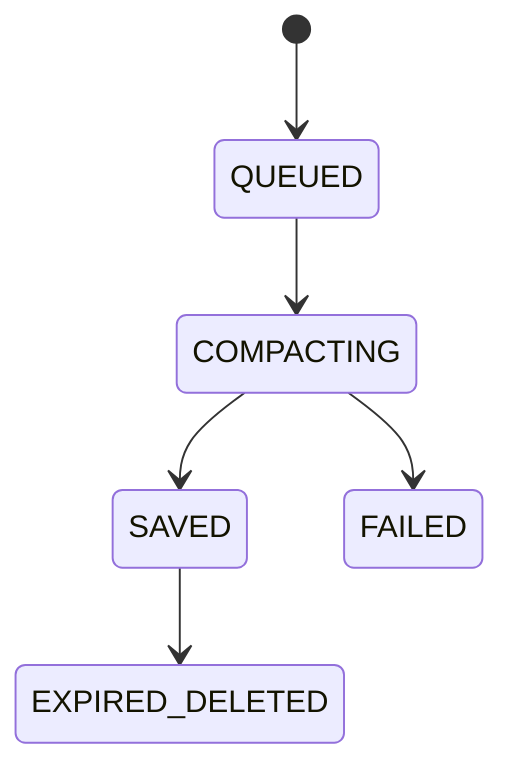

# Domain Specification — DASS Upload Service

## 1. Visão Geral

O domínio controla aplicações internas autorizadas e o ciclo de vida de documentos enviados ao storage local.

## 2. Entidades

### Application

Representa um sistema interno autorizado a enviar arquivos.

Campos:
- `id`: UUID.
- `name`: nome legível.
- `folderName`: slug único usado como pasta física e chave de upload. Deve ser seguro para path.
- `isActive`: define se a aplicação pode fazer uploads.
- `createdAt` e `updatedAt`: rastreio temporal administrativo.

Invariantes:
- Uploads só são aceitos quando a aplicação existe e `isActive=true`.
- Remoção administrativa é soft delete via `isActive=false`.
- `folderName` deve casar `^[a-z0-9_-]{3,100}$`.

### UploadedDocument

Representa o ciclo de recebimento, processamento, armazenamento e expiração de uma imagem.

Campos críticos:
- `applicationId`: FK para `core.applications`.
- `correlationId`: UUID para rastreabilidade cross-service.
- `originalName`: nome recebido.
- `fileName`: nome final gerado pelo backend, atualmente `{correlationId}.webp`.
- `filePath`: caminho temporário inicialmente, caminho definitivo após `SAVED`.
- `fileUrl`: URL pública preenchida após `SAVED`.
- `mimeType`: tipo recebido inicialmente; após compressão bem-sucedida, `image/webp`.
- `retentionDays` e `expiresAt`: regra de expurgo físico.
- `status`: estado da máquina de processamento.

## 3. Status

| Status | Descrição |
|---|---|
| `QUEUED` | Registro criado e job publicado. Arquivo ainda está em `tmp/`. |
| `COMPACTING` | Worker iniciou processamento Sharp/WebP. |
| `SAVED` | Arquivo WebP foi salvo no storage final e metadados foram atualizados. |
| `EXPIRED_DELETED` | Cron removeu o arquivo físico expirado, preservando auditoria. |
| `FAILED` | Worker falhou e descartou o temporário quando possível. |

