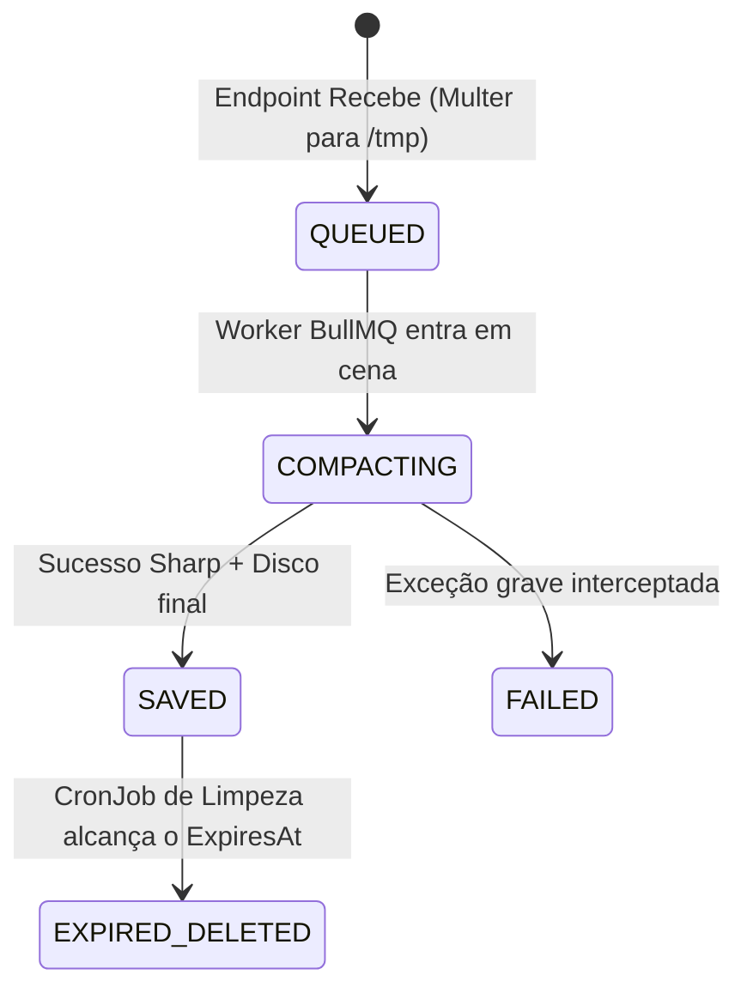

# Domain Specification — DASS Upload Service

> [!NOTE]
> Para fluxos operacionais, leia [FLOW_SPEC.md](FLOW_SPEC.md).
> Para schemas SQL, leia [DATABASE_SPEC.md](DATABASE_SPEC.md).

---

## 1. Visão Geral do Domínio

O domínio foca no rastreamento de aplicações internas da DASS previamente autorizadas e no gerenciamento assíncrono do ciclo de vida de arquivos, determinando sua persistência física ou limpeza baseada em regras temporais no servidor (VPS).

---

## 2. Entidades

### 2.1 Application

Representa os serviços/sistemas internos da DASS que possuem autorização expressa para gravar dados no servidor de arquivos (ex: "Pense e Aja").

**Campos Críticos:**
- `name`: Nome legível da aplicação.
- `folderName`: Nome validado da pasta raiz física onde os arquivos da app habitarão.
- `isActive`: Define se a aplicação continua apta a operar requisições HTTP na borda da API.

### 2.2 UploadedDocument

Entidade central que representa o recebimento de uma mídia, seu estado real no disco temporário ou definitivo, e seus prazos de validade.

**Campos Críticos:**
- `applicationId`: Chave estrangeira atestando a paternidade do documento.
- `correlationId`: UUIDv4 para interoperabilidade e rastreabilidade cross-service no ecossistema DASS.
- `fileName`: Nome computado (uuid + ext) e sanitizado pelo backend para salvar no disco de forma irreversível contra colisões.
- `fileUrl`: Rota servida publicamente (ex: Apache proxy) para acesso da aplicação cliente à imagem.
- `retentionDays`: Propriedade crucial (persistence). Representa dias de vida antes da remoção física. Nulo (vazio) simboliza que será retido para sempre.
- `expiresAt`: Data concreta pré-calculada (`createdAt + retentionDays`) no momento do upload, indicando o threshold do CronJob de expurgo.
- `status`: Define a localização transiente da máquina de estado da entidade.

---

## 3. Máquina de Estado do Documento

### 3.1 Status Permitidos (`DocumentStatus`)

| Status | Descrição |
|---|---|
| `QUEUED` | A reserva do arquivo ocorreu na API. Arquivo cru reside na pasta local `/tmp`. O Worker do BullMQ foi convocado. |
| `COMPACTING` | O Worker adquiriu o job. O pacote Sharp está em curso transformando, redimensionando ou otimizando a mídia. |
| `SAVED` | O arquivo foi gravado de fato na pasta definitiva (`/storage/appName/`). Transação com DB foi commitada. |
| `EXPIRED_DELETED` | O artefato completou seu `expiresAt`. O CronJob expurgou seu arquivo físico da VPS de forma irrecuperável, preservando este status histórico no PostgreSQL. |
| `FAILED` | Processo colapsou (falha de memória, erro I/O disco). O tmp é descartado para não inflar a VPS e o DB é atualizado. |

